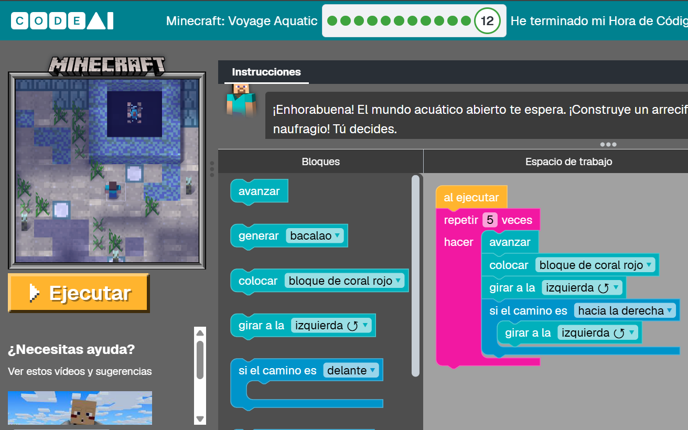

<h1> Experiencia en Voyage Acuatic </h1>

<h2> De que manera resolvimos eso </h2>

 Lo primero era analizar que boques de acción nos daba la pagina, en base a eso observábamos el objetivo de ese reto y los elementos que disponía en el mapa. Finalmente comenzábamos a ubicar los boques probando diferentes programaciones buscando siempre optimizar la cantidad de bloques que usábamos, por eso se debe de tener en cuenta los bloques que nos permiten hacer mas de una acción a la vez para aprovecharlos de la mejor manera 

